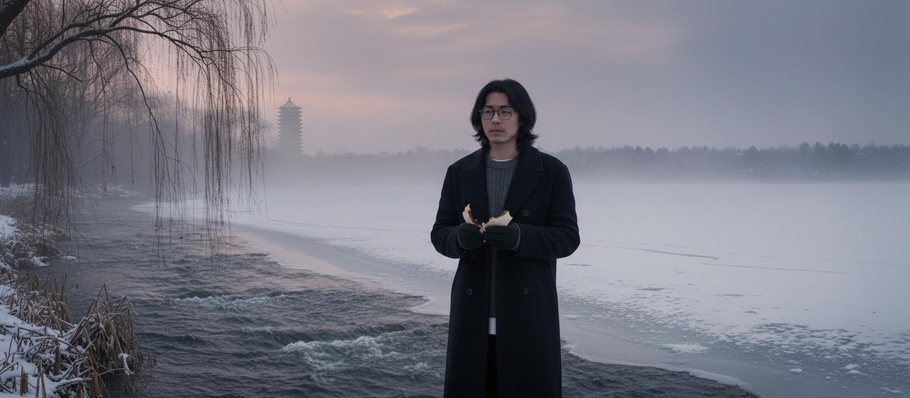

柳君的公众号推送了一篇小文，题为[《逝川祭》](https://mp.weixin.qq.com/s/EbCd9gXipseVoGNHeF6Vog)，略读之后甚感有趣，遂摘录于此。

<!--more-->

## 序

二四年夏末，我和川重逢在家乡的田埂上。

“我最近迷上了一部美国人写的戏剧，叫《推销员之死》，感慨颇深。我想，我们的土地也未尝没被美国梦之类的东西浸润过。所以……”

“所以你想写一部本土版的什么什么之死吗？”

川不愧是至交。

“是啊，可是我想先丰富地收集灵感。能把你成年之前的疼痛、恐惧都回忆起来吗？”

“哎，过去很久了啊，我得好好想想……要是《逝川集》没丢就好了。”

要是《逝川集》没丢就好了……

我一下怔住了，是啊，要是《逝川集》没被我弄丢就好了。虽然川没有怪罪过我，我还是过意不去。

有趣的是，直到发现《逝川集》丢了，我和川才真正意识到它对于我们俩的重量。

二三年夏，辞京返乡后我倍感无聊，便翻找起旧时文字。

怎么？没有？不不不，我记得初三的日记本就夹在这里……

高一那些小说的手稿呢？儿时的杂记呢！

这些都不足以让我沮丧，可我立马就意识到，我辜负了挚友的托付。

那本《逝川集》！二一年冬，十七岁的川亲手交付到十七岁的我手里。当时川毫不留情，像决心要摆脱累赘一样将它丢弃给我，说我看完便扔了、烧了也无妨，彼时的我也没太珍视这本粗制滥造的小册子。

二二年毕业离乡前，我心想这毕竟是挚友少时的激昂文字，将来彼此胡子花白，再摆出品评，也可博得一笑，便小心翼翼地将其夹在旧时手稿堆里。不想，《逝川集》如今随着手稿们都不知归处了。

急火攻心的我一时失态，责问了祖母。

“你离家这么久也不回来。我又分不清是废纸还是草稿，放在那犄角旮旯里我就以为不紧要，估计哪天收拾垃圾一块儿给扔了吧。”

看着祖母冤枉的样子，我意识到确实是我的错。可我该怎么面对挚友呢？

川得知了弃子失踪的消息，没说什么，但一定也若有所思。因为自那以后，他便陆陆续续在私人博客上写了若干追忆与悼念《逝川集》的散文。

这些晦涩的乱七八糟的文字，竟成了我近来乏味生活的依赖。每如饥似渴地啃食一篇，就有一小会儿恍惚又看见十七岁的川和我——当时的悲愤、跌宕、自命不凡、自讨苦吃，哪怕再重新感受一秒，我都泫然泪下地满足。

川见我这副样子，也颇有感触。几日前，他找我说：

“柳君，我把博客上那些大大小小的拙作打包喂给了一个叫Gemini的国外AI，想让它整理成书——我觉得，我们对《逝川》那段岁月的依恋就此为止吧。”

我震惊得说不出话来。

“不过，这件事还得靠你来画上句号啊。那个AI编纂出来的东西，怎么看都不尽人意，有些地方辞不达意，有些地方又啰里吧嗦。”

“AI毕竟是AI啊。”

“是啊。而且，只有你明白我写的那些谜语。”

这是一件开心的差事。世界上令我开心的差事少之又少，一度让我觉得我除了混吃等死什么都不会，还常常向川自嘲“活腻了”，没承想川还真给我出了个解腻的法子。

前日，我去某园林游玩，告诉了川。川问我，“你今天看见’留恋的斜阳’了吗？”

我会心一笑。“再也没有留恋的斜阳”——这是我和川都喜爱的一句歌词，可能因为应景，这首歌常伴着我看川博客那些文章。

“可惜，回来得早，还没日落呢……
不过没事啊，等我把这本书写完了，‘留恋的斜阳’就被我永远地裱起来了。我们都能看见。”

**柳诚音**
**2026年1月12日**

---

## 卷一：熔炉铸器

### 第一章：糜烂之浴

川感到正被溶解。

不是比喻，而是种缓慢的、无法逆转的物理过程。

躺在浴桶里，宛若被腐蚀一切的滚烫糖浆紧紧包裹着。体表早已沦陷，那一片片绯红，不知何时已成一种迟钝的舒适。在这层烧焦的茧壳之下，有样东西，却像深埋极地的顽石，寒冷，坚硬，无知无觉。

那是他佯装跳动的心脏。

浴霸投下病态的光，橘黄色穿透充盈的水汽，升出亿万微尘光点。狭小煞白的囚室，恍惚间俨然泰山顶日出前的雾海。

乐景衬哀。这雾气沉甸甸地压在胸口，灌满鼻腔，每一次呼吸，都像是溺水。他正在窒息。

空旷的脑海底冒出一个泡——

“我已经不能思考了。”

身体仍在消融。

“现在应当停止了……”

好像在某个时刻曾说过这句话——依稀记得，听者皆脸色大变，眼里流露惊恐或怜悯。

“停止”——几分钟前，似乎就有过在这浴桶里停止的冲动。可是，我是想停止什么呢？是停止这灼热？是停止这窒息？还是……

一旁的小凳上，手机亮着微光，是社交媒体的界面。

刚刚……是在给别人发消息！

像被一枚图钉刺了下神经，他醒了大半。

发了什么呢？怀着孩童般的好奇，他伸出手。

> 过去自以为学会了哲学家的口吻，就能变成哲学家
>
> 狂妄自大！
>
> 我浅薄的思想却在这些故作姿态的辨析中欲盖弥彰
>
> ……
>
> 这是新生的萌芽，是日出
>
> ……
>
> 不过是“时光流逝之空虚与无人能解之孤独间永恒的矛盾”罢了
>
> 无论是否有失偏颇，我的痛苦都消融了
>
> 啊……真轻松啊

川根本无法理解这些分不清是深奥还是虚伪的废话。

简直像个戏服不合身又台词蹩脚的三流演员。真是奇怪，我为什么会说这种话？

“请你不要再来害我了。”

他一跃而起。

滚烫的水四散飞溅，他赤裸的身体撞上空气的刹那，宛如被千万把刀凌迟。

全都想起来了。

原本焊死的记忆之门猛地被撞开。门后无光，无声，唯有深不见底的黑。生命仿佛戛然而止，直直地坠入其中。

再次睁眼，已是凌晨，窗帘映着靛蓝，城市仍在沉睡。

川像一截被抽干水分的朽木瘫在床上，习惯性地拿起手机准备翻阅社交媒体，却看到一条崭新的消息，是几分钟前。

“早安。”

良久，川只是盯着这两个字。这是他该说，却永远也说不出口的话。

我想起来了——

我终于能够安眠，不必再担心那些隐晦的角落里会不会滋生出魑魅魍魉。

川兴奋了许久，欣喜地告诉她，这是她的功劳——她施展了某种令人安心的魔力。

可是，她究竟做了什么？

“请你不要再来害我了……”

不，她什么也没做。

原来，所谓安眠，代价是绝对⿇木。所谓治愈，代价是断绝外援。

从今天开始，我会继续安眠……

川又变回一株糜烂的水草，只是这一次，他不再漂浮于炙热的浴桶。

早安，午安，晚安。

凝视着那两个字，川在心里声情并茂地回复着。

终于能够安眠了。

这究竟是恩赐，还是诅咒？

### 第二章：阴影的奇点

那是个足以笼罩世界的极夜。又或许事实上是个晴天。记忆早已模糊。

川那时只有五六岁，像一株新抽芽的植物，毫无防备，只有好奇。

孩子们在嬉戏，院子里弥漫着泥土的腥气和青草被踩断的汁液味。尖叫、笑声、追逐声，装满了快活的泡沫。川也在其中，感受风从耳边掠过，小小的胸腔里敲着飞快的小鼓。

他追逐皮球，身体正跃至半空，那个想法——

“我死了，怎么办？”

——像一颗冰冷的陨石，毫无预兆地砸中了他。

万籁俱寂。他呆呆地落在地上，皮球滚到远处却浑然不觉。所有感官都关闭了，只为疯狂地计算这问题的答案。

这问题是从哪儿冒出来的？它不属于这个阳光灿烂、芳草鲜美的午后，不属于孩子们的游戏！它是个幽灵，是个不速之客！

答案其实在提问时就跟着得出了。

“一切会结束，万念会消失。”

清晰、冷酷，不容置疑。

没有轮回，没有天堂。对这世界的全部感知，将像一支蜡烛被无情地吹灭。而太阳会照常升起，皮球会被另一群孩子捡起。一切如常，只是“我”，这个独一无二的思考者，将不复存在。

前所未有的恐惧席卷了全身。这恐惧不知从何而来，但切实存在。

川人生中第一次失眠。

心脏剧烈的跳动声，不再是生命力的象征，倒像沙漏，每次跳动都宣告终点的逼近。眼皮合上后那片纯粹的黑暗，像是在模拟死亡，他不敢闭眼了。

他开始哭泣——压抑的抽噎——放肆的号啕！

“妈妈！我不想死！”

川紧紧抓住母亲的手臂，如同溺水者抓住迟来的援手。

他急需一个坚实的拥抱，一句有力的承诺——

至圣女神的化身啊，请告诉我死亡是一个谎言！我会永远安全！

母亲的神情被黑暗蒙蔽，她握着川的手，不再温暖，只有僵硬。川隐约明白，自己莫大的恐惧传递到母亲那里，成了一种无言以对的负担。

许久，仿佛从很遥远的地方传来了母亲的细语：

“别怕，宝宝还小呢，不会的……”

惨白的安慰，大人的敷衍！川和恐惧间的羁绊更深了。

“最深的恐惧，无法被最亲密的人承载。在终极问题面前，我只能是孤身一人。”

仿佛生命的奇点，五彩斑斓的体验，便从这块小小黑洞中无限膨胀开来。

### 第三章：巨蟒与囚徒

山阳一中的跑操，是一场盛大而无声的交响乐，指挥家是个看不见的人。

数千蓝白校服，像被磁石操控的铁屑，在每个清晨汇入这条红色巨蟒。

川被裹挟着向前，身体已对这场仪式烂熟于心。胳膊和腿像一套精密的连动杆装置，随着节奏前后摆动，偶尔发生轻微的碰撞。

没有一处需要思想插手的地方，思考反而会打乱肌肉记忆。最舒适的状态，就是放空一切，随波逐流。

太无聊了！

这念头一闪而过。

川开始琢磨一些不为人知的小游戏。今天，他观察自己的手。

仿佛第一次见这东西，真神奇，它有自己的生命。没有川的驱使，那拳头兀自紧攥着，且随着手臂后摆会微微张开。

驱使它的不是我，那是谁呢？

令人不安。

手，腿，心脏，所有这些器官，它们是合谋的一伙，共同维持着这具名为“川”的躯体运转，但它们的意志，真是我的意志吗？它们是否在算计我呢？

鸡皮疙瘩迅速布满了全身。在酷暑，川感到骨髓里渗出一股寒意。

是的，我被欺骗了！这念头越发清晰，越发不容置疑。

它们骗我说：我们是一体，存亡与共，这具肉体的存续，便是“我”的存续。可肉体的消亡，便是“我”——那团正在思考的云雾——的消亡吗？难道我——被囚禁在这具联动装置里的真正的“我”，不得不屈从这些零件险恶的胁迫，跟它们一同走向死亡吗？

难道……难道……

“观察那个观察者。”

谁！？

他猛地一惊，差点被自己绊倒。那声音，既陌生又熟悉，既粗鲁又深邃，似有种古老的智慧。

是那个真正的“我”在对我说话吗？

他试图捕捉声音的来源，欲观察那个正在观察这具机械跑操的人，却登时陷入更深的眩晕——

当我观察那个正在观察的“我”时，此刻这个进行观察的又是谁？

这是个逼疯理性的无限套娃式悖论。精神解离带来的折磨，比跑操的无聊还痛苦一万倍。

他重重地践踏跑道，想用实在的物理接触，把自己从缥缈中拉回来。

巨蟒仍在衔尾蠕动。无人听见川内心的海啸，他依然是数千蓝白囚徒之一，躯干仍在无意义地摆动。

可有些看不见的东西，已发生了不可逆的改变。

跑操即是吾人生之缩影——被无形的巨蟒裹挟，沿着既定的轨道被迫拼命向前。而所谓“川”者，只是个幽囚于内、软弱无能的旁观者。

第一次哲学预演落幕了。那个突然出现的声音，点燃了星星之火。

### 第四章：最终审判

“请你不要再来害我了。”

X，向阳花一样，是能让老师和同学都喜爱的完美晨间剧主角，简直和川来自相反的星系。

那天文学社的讨论书目是加缪的《局外人》。社员们正千篇一律地围绕“荒诞”、“反抗”这类老掉牙的词陆续发表“见解”。

“默尔索被判死刑，不是因为杀了人，而是因为没有在母亲的葬礼上哭。”

川沉默了许久，只迸发出这么一句。

没人把他当回事，几秒尴尬的寂静之后，便又延续原本的讨论。

唯独X的眼睛亮了一下。

大抵就是从这时候起，X频繁问川错题，尽管自己成绩比他好得多。过了几日，X竟敢端着餐盘，径直坐在一贯“吃独食”的川对面。

严苛的法官开始尖叫，仿佛在警示来自天敌的威胁——

这号人的接近会揭露你所有的奇形怪状！

但渴求倾吐的孩童，却贪恋久违的温床。

孩童终究战胜了法官。

晚自习结束后，他们并肩走回宿舍，路灯把影子拉得很长。X像往常一样分享生活趣事，川像往常一样只是听着。

“川，”X突然驻足，转身凝视着川，“你好像总是不开心。你是不是瞒着我什么事？”

路灯恰巧在X身后画上一圈柔和的光环，使其俨然一位愿意赦免任何罪孽的天使。

封锁已久的堤坝，此刻有了一丝裂缝。十多年了，他没跟任何人讲述过。

他不敢看X，只盯着扭曲的影子，似要将沾满血污的祭品捧到X的面前。

拜托了！这一次，我想得到一个温暖的、和母亲不同的回答！

……

这比当年母亲听后还要漫长的沉默，算是什么？

一丝愠怒怂恿他抬头看向X。X的脸色有些苍白，不自觉地向后挪动。

“川……你……你为什么要想这些？这太……太沉重了。人活着，开心一点不好吗？”

“沉重”！

这两个字，像两根冰锥一样砸了过来。

X不是什么天使！只是个善良的过客，并非与众不同。X对我的好奇，就像在逛博物馆时对异域展品的好奇——可以欣赏它的独特，但若它突然活了，并展⽰起阴暗黏稠的内壁时，X只剩恐惧。

那天以后，X依然会对他微笑，但多了些礼貌和拘谨。他们不再主动找彼此。偶尔说上几句话，净是鸡毛蒜皮。

那条不慎裂开的缝——川用更厚的混凝土封死了。

严苛的法官以嘲讽的口吻宣判胜利：

“瞧吧！不听老人言！藏好你的秘密，别再给他人平添负担。”

一个月后，川的精神恶化到了极点，失眠、忧虑、失忆接踵而至。

梦呓一般，他语无伦次地打出一条条长信。

再睁眼时，终审判决书已送到了眼前。

“请你不要再来害我了。”

最终的定罪是，他是有害的。

川拼命地拍打浴汤，水花四溅，随后又长久地一动不动，凝视着满身的绯红。

川立誓，从今天起，做一个快乐的人，做一个倾听者和安慰者，用最温暖体贴的共情去应对这个世界。

那个“害人”的怪物，必须终身监禁，能处死最好。

### 第五章：牛皮纸上的神谕

这次审判之后，川成了位善解人意的“外交官”。

高压的岩浆找不到出口，只会更猛烈地爆发。习以为常的倾诉对象X彻底失灵后，那股能量无处可去，只得顺势倾泻到纸上。

他的写作是不从容、不经构思的，更像重病者痉挛的呕吐。

房门紧锁，废寝忘食。

二十二张厚实的、纤维质感的发黄牛皮纸，和那支墨色浓淡多变的钢笔，谱下了日后命名《逝川集》的文字。

那个阴沉的下午……

那夜母亲无力的安慰……

跑操时顿感的抽离……

对死亡新鲜到恶心的畏惧……

与X那场未尽的对话……

日夜重演的自己同自己争辩……

墨水渗透进粗糙的纸张，像是把他的灵魂拓印了下来。

极致的痛苦，极致的释放。放下钢笔，川感到前所未有的轻松。他不再是痛苦的奴隶，而是痛苦的主人。就像是驱魔师终于将体内的魔鬼逼出，封印在了一本册子里。

他将牛皮纸仔细整理好，捆扎起来，放在书桌上。它看起来不像一本书，更像某个古老文明的卷宗，记载着许多未知禁忌。

轻松不过几日，更大的隐患发生了——沉迷。

作者往往成为自己作品的第一个忠实信徒，就像自残者舔舐手臂上新划出的伤口。

这些文字有魔力！而自己竟是这魔力的缔造者！却也是其俘虏。

“我在着魔了。”

深夜，川一边默读，一边恐惧且欢快地战栗。他自言自语道，“我是在享受吗？”

这东西本该是“垃圾桶”，现在却成了我膜拜的“神龛”！

远离这阴险的无底洞！

冲动下，川决定把魔盒封存起来。他叫来柳君等二三好友，作为见证者，巩固他向好的决心。做了简短的展⽰后，川郑重地将其封存在铁盒里，上了锁。

川天真地以为，一场仪式，就能封印住一个魔鬼。潘多拉的魔盒一旦被创造出来，就拥有了自己的生命，不断地引诱罪恶。

一年后在穷冬工坊的奶茶店，川决定将《逝川集》托付柳君时也并未料到，这魔盒将在未来怎样无情地拨动二人命运的齿轮。

熔炉之火未萎，利器已然铸成。它正等待着第一个祭品。

## 卷二：瘟疫之匣

### 第六章：穷冬之茶

穷冬工坊，是片由旧厂房改造成的商业区。粉饰的墙、霓虹招牌、贩卖廉价快乐的小店，都难掩工业遗留的萧索。而山阳一中，正像受难的十字，插在工坊正中。他们曾不顾囚徒的身份，在这穷冬里幽灵般游荡。

周六晚，解脱的学生像一群快活的牲口冲出围栏，塞满工坊东北角一家小小的奶茶店。奶精、糖浆和汗液味儿打成一片。

催单的呼喊、机械的轰鸣、少男少女肆无忌惮的笑闹……

两座沉默的礁石，被这片海洋围攻。

川疲惫地倚墙等待。柳君也一言不发，大概也在回忆一个月前的义卖会……

斜阳下，川远远看见柳君穿过熙攘的人群，冲到面前，面部肌肉抽动着。川以为出了什么急事。

柳君缓了口气，抓住川的双肩，直直地凝视他。

“根本就没有意义……我是说，这世界上本就没有’意义’这两个字！

川，我其实一直……怎么说呢，虚无？我感到虚无，我……我很痛苦。”

柳君竟眼眶湿润。

这有点猝不及防！这些话，是从柳君口中说出的吗？那个嬉皮笑脸、特别要强的男孩，今天是怎么了？

竟然说出了我一直不敢说的那些话……

明知自己更是病入膏肓，川却用近乎说教的口吻，尽力宽慰柳君。

多么苍白啊！我自己听了也会厌恶！

斜阳已逝，人去楼空，二人伫立在狼藉中。

绞尽脑汁的含糊其词被柳君一一强硬地塞回。川再也承受不住那热烈攫取的眼神了。

“我……正在写一本小册子，或许能在某种程度上解决你的问题……下个月我给你。”

今天，该是兑现诺言的日子了。

洗得发白的帆布书包里，二十二张牛皮纸捆扎得一丝不苟。在奶茶店斑斓的灯光下，它像只睡得很沉的圣婴。

“这是一本邪恶的书……”噪音几乎吞没了川低沉而异常诚恳的声音。

“它会毁掉人的一生，不宜多看。最好只留个封皮当纪念，然后就帮我烧了吧。”

至少在当时，他说的是真心话。要是唯一的挚友被瘟疫感染就坏了。

“没事的，一本小册子而已，我看看就好。”柳君捏在手里掂了掂，不以为然地笑了。

“别以为我不知道，你真希望我烧了它？你心里也想有人能好好看看，对吧？”

川无言苦笑。

世上真有两个人能看见同一片风景吗？要是有，那也是幻觉。渴求被理解，是人天生便罹患的绝症罢了。

不过，且让柳君一试吧。

冰凉的奶茶终于滑进喉咙，却有些苦涩。看着挚友小心翼翼地将珍宝塞进书包，川露出恬静的忧伤。

他担心的，正是书本上那句：

”千古幽扃一旦开，天罡地煞出泉台。
自来无事多生事，本为禳灾却惹灾。”

### 第七章：广场辩论

柳君开始频繁地找川，话题也离现实的琐事越来越远。

废弃的喷泉广场，是二人的“哲学乐园”。

水池早已干涸，积满尘土与落叶，像只巨大空洞的眼窝看向天外。为了避开人群，二人常躲进这里。

他们绕着枯池一圈一圈地踱步，谁也没先开口。暮色渐浓，此地没有路灯，已快看不见彼此的面目。

叹息……

张望……

驻足……

瞑目……

头顶忽的响起一阵乌鸦的啼哭，扰乱了二人强装的沉静。

“川，人是为什么而活？”

“你自己怎么看？”

柳君一时语塞。

“……我不知道。我感觉我只是在为他人活着，为了家人，然而家人又是为了我。我仿佛不存在了……”

川小心翼翼地说，“就像随波逐流的船，被他者的欲望与期待推动？”

“就是这样！每次想到这儿，再回想自以为傲的过去，总莫名凄凉。”

川恍惚看见了曾经的自己。恐惧油然而生——不能再酿出祸了！

世上没有包治百病的药，即便是相同的症状，对不同的人，也须探明根本，对症下药。

没错，这次他决心扮演医生。

“《逝川集》的心境，我多少有所体会。大概我也沾染了所谓虚无主义。人生的本质不过如此啊……”

“本质？！”

“差点被你平静寡言的外表骗了啊。没想到你也会写出这么感性的话……内心也有不少痛苦与挣扎……生命无意义——多么可悲的事实啊。”

该怎么办呢？那些廉价的花言巧语安慰得了别人，欺骗不了柳君。

柳君说了这半天，正期待着我回应呢……只能直来直去了！

“我想，你的问题并不是虚无主义，而是你对虚无主义的理解。”

川看对方并无不满，才继续说：

“你毕竟也没有自杀，无论是客观还是主观来说，你的生命都是有意义的。
你或许对现在、过去的自己不满，但你可以行动，可以改变未来的自己。
总之，现在的被动与苦痛只是片刻的，你的生命并非彻彻底底的虚无。”

柳君愣了一会儿，叹气道：

“太理想化了。现在的你恐怕也读不懂当年的文字吧！
生命之本质，恰在于生命本身无意义，故吾谓之曰’虚无’。意义乃人所强赋，若形而上地观察世界，便发现意义是如此无聊，如此虚伪！为了无意义的意义而活着，岂不比无意义地死去更无意义！”

空旷的广场突⺎地回荡起川的朗声大笑。

“柳君，你当真会天天审视人生的意义吗？当真会因为’无意义‘而持久痛苦吗？”

突如其来的严肃吓得柳君一时慌了神。

“……我想是不会的……只是在某些时刻……然后又会忘记……然后又会突然……”

“那你的问题就不能叫虚无主义了，顶多叫‘持续性现实主义、间歇性虚无主义’。”

看着柳君沉思的样子，川自觉棋高一着，便笑着追击。

“我们常常一起嘲笑那些回避思考人生意义的人，然而若每次思考，都直接以无意义的结论去搪塞，跳过本该有的审视，沉溺于情感之中，岂不和那帮人一样可笑吗？
可以说，你在这个问题的思考上正是犯了虚无主义的错误。根据答案去制定推理过程，岂不是百发百中吗？
你轻信感性的判断，就像个狂热的邪教徒，理性都建立在虚假之上！”

柳君仍无言，可也不见愠色。

“这就是《逝川集》的阴险之处！你回去赶紧把它扔了吧。”

许久，两人都不再吱声，川以为这事儿就过去了。

远处公路上一排排路灯齐刷刷地亮起，川这才惊讶地看清——昏黄中，柳君黯然神伤的眼眸，仿佛迷路的孩童。川不禁有点尴尬。

“呃……都已经这么迟了啊，哈哈，该走啦……”

“我想知道，你是怎么看的？你觉得生命的意义是什么？”

……

“如果非要问我生命的意义，我只能回答——虚无。
虚无感迫使我追寻意义，活着的一切都是为了对抗虚无……”

### 第八章：面具背后

川正准备接受柳君顿悟后钦佩的目光，一阵刺耳的铃声响起。

是柳君母亲打来的。催促、责骂、质问，把刚才那个天马行空的魂一把揪了下来。

柳君挂断电话，露出一丝歉疚。

川目送着，看着渐远的背影融入万家灯火，消失不见。

川站在那颗巨大的眼窝边上，几片落叶被风卷起，发出沙沙的声响。刚才那番智斗凯旋的喜悦，像退潮的海水般溜走。

他暗自庆幸，到底忍住了，没有说出真正的想法。

他所谓的“对抗虚无”，不过也是一场永无胜算的骗局。

真正的虚无，不是可以被讨论、定义的哲学概念。它是古老如黑洞的存在。没有因，没有果，只是存在在那里，不紧不慢地蚕食着一切。

倘若现在就对柳君说出真心话，不知会酿成什么样的恶果！

我做的，是正确的吧！

是啊，开心起来吧！

唱一支歌吧！

是啊，今天，我赢了！

我用精彩绝伦的辩论，成功扮演了一回“精神导师”，却也成功在我和柳君之间砌上了一堵高墙。

我赢了这场辩论，却输掉了一个最有可能与我并肩立在断崖边面对深渊的人。

夜空被城市熏黄，天狼星独自苦撑。

摘下小丑面具的演员，在剧终散场后也是这样，独自面对着台下空洞的黑暗吧。

不，那面具上画着的，是智者的微笑。

## 卷三：异端之火

### 第九章：鱼儿与叹息

雨滴点点，涟漪荡漾。川看着湖面下隐伏的鱼儿，轻轻叹了声气。

无畏的生灵啊，睁着双目却不见光明，摆动着鳍却随波流浪。薄膜似的嘴如管风琴般开合，把雨滴误当作善良的投喂。

愚昧的生灵啊——我又有什么资格嘲笑它们？

我也是一条鱼，在一片更浑浊的水域里艰难地呼吸。

倏然间，鱼儿活泼的身形跨越湖面。

她撑着透明的伞，在细雨中跳跃，不知愁滋味。

川紧绷的脸漾出笑意。

那年冬天，他碰巧有事儿要回山阳一中一趟。久别重逢，总忍不住期盼些什么，多少有点喜悦。

路过曾经的班级，川不由地止步。

讲台上没有老师。书山书海中，无数双小臂默契地摆动。

川泛起一阵恶心，回忆的滤镜霎时间破碎，驱赶他逃离。

身后突然传来一声轻叹——两声——三声。

一双手从背后轻柔而坚定地缠绕在川的腰间。不必回头，一定是鱼儿。

川曾把自己关进戒备森严的监狱，她却找出一条秘密入口。

“我一直在等你噢，”带着雨后青草的气息，“怎么这么久才来呢？”

鱼儿的无拘无束，只会衬托出自己的死板沉重，所以他厌烦。

川试图掰开她的手。她却像一株捕蝇草，收得更紧。

后背涌进一股柔软的温热。

川愣住了。这正是他渴盼已久的，此刻却又胆战心惊。

许久，捕蝇草还是松开了。川呆呆地转过身，还没来得及说什么，她却笑了。

……

额头涌进一股柔软的温热，川醒了。原来是她的唇。

川起身，只听得外面淅淅沥沥。

“回家吧，我不太舒服……听，声音都沙哑了。”

她没有追问，用手指轻轻拢着他的耳朵，额头贴着他的额头。她眼里太过明亮，会刺痛习惯了黑暗的瞳孔。川只好闭上眼睛。

“我也不太舒服……回去吧。”

细雨中，鱼儿扶着他，像搀扶一位病患。

鱼儿把他扶到榻上，自己也横躺下来，头就枕在他小腹上。

“别绷得那么紧嘛。”

川苦笑着，“不是故意的。”

“还在想那件事吗？”

……

川几乎没有回答过她的任何问题，只是任由它们在沉默中回荡。

听着鱼儿逐渐均匀的呼吸，他也渐渐沉入梦乡。

再次醒来，身旁已经空了。

又是这样的结局么？

川对着雨发了好一会儿呆。扭回头，他愣住了。

房间的另一头，鱼儿美丽的曲线若隐若现。

川一寸一寸贪婪地打量着，浑然不觉那双被泪水洇红的眼睛。

“你一直在怀疑我吧？怀疑我不诚？
怀疑我不真？”

为了仅存的一丝良心，川微乎其微地摇了摇头。

他很想告诉鱼儿，这不是你的错，甚至也不是我的错。

见川不作声，她直直地看着他，如殉道者一般宣誓，

“我会证明的！用我的一切！”

她像猎豹一般钻进川的身体，川感到胸前滚烫的湿润。

他忍不住轻轻逗弄眼前蜷曲的发丝，胸前竟也随之更加湿润。

鱼儿猛然抬起头，泪眼婆娑地哀嚎，

“给我水！给我氧气……给我水！给我氧气……”

川听不清。昏暗中，他看见鱼儿曾为他歌唱《诗经》的画面。

银河般的眼睛里，闪烁的是什么呢？

是崇拜？

是爱？

还是，救苦救难的慈悲？

徒劳的慈悲。

“鱼儿！我……我还是不太不舒服。也许还不到时候……

雨停了，我想出去走走，以后再说吧。”

川径直奔进雨中，背后传来大河倾斜的声音。

### 第十章：审判之祭

鱼儿坐在床上，像一尊美丽的雕像。

川走到她面前，将那本沉甸甸的手稿，郑重地放在她的膝上。

“这是什么？”

“你一直想要我回答的问题。
一切的根源。”

川瘫坐在椅子上，盯着她的反应。

鱼儿的眉头微微蹙起，扫了几眼便合上，随手放在床头柜上。

“川，”她抬起头，挤出温柔的微笑，“我很喜欢。我太爱了，爱到想把它占为己有。”

川一声不吭，起身从墙角拎起那只他们冬天依偎取暖用的小火盆，掏出一盒火柴。

鱼儿的脸色暗了下来。

“你要做什么？”

川抓起床头柜上那堆废纸，蹲下身，划亮火柴，扔进了火盆。

一小簇橘红在铁盆中央跳跃起来。

“川！不要！”

鱼儿惊叫起来，可已经晚了。

呛人的青烟升腾。火苗饥饿地撕咬纸张边缘，牛皮纸痛苦地蜷曲，转瞬裂变成一片片轻飘飘的黑蝴蝶。

鱼儿扑上来，抢夺他手中剩下的纸。川岿然不动，面无表情，像个执行神圣仪式的祭司。

火苗吃完最后一口，川推开窗户，寒风呼啸，灰烬四处飞散。

他躲闪不及，一具顽强的残骸，伴随着浓烈的腥臭，蒙住了眼睛，遮住了天。

川匆忙摘下，低头一看。

焦黑的残页上，三个歪歪扭扭的大字依然可辨：

逝——川——集……

### 第十一章：雪地狂奔

女人失魂落魄地看着火盆——那燃烧着谎言与背叛的地狱。

耳畔爆发出野兽般的啸声，凄厉绵长。鱼儿浑身一颤，惊恐地看向川。

川瞳孔巨大，猛地抓起滚烫的火盆，倒扣在自己身上！

皮开肉绽，他仿佛失去痛觉，像一颗出膛的炮弹，冲向敞开的窗。

三十四层高楼下，是深不见底的黑。

这一刻仿佛永恒。川感觉不是在下坠，而是在飞翔。

疾风奏响宏大的交响乐。在黑暗尽头，他看见一片倒悬的星河。那是万家灯火。

他张开双臂，准备拥抱新世界。

毫无征兆地，下雪了。

雪花又大又急，仿佛整个天空的棉絮都被撕破了，顷刻裹满了大地。

川就像跌入了一个软绵绵的纯白色的梦，竟毫发无伤。

他从雪坑里爬起，环顾四周，如临仙境。

他开始狂奔。

没有方向，也没有鞋。雪花疯狂抽打脸庞，脚趾冻得先红后紫而后白，却不疼。

他横冲直撞，飞越被淹没的街道、高楼、丘陵与河流，胡乱地丢下巨坑般硕大的脚印。

“那个疯子足足奔出了四五十里，再也没回来过。”

### 第十二章：残叶

⽕盆⾥的余烬渐渐熄灭，寒意侵袭⽽来。我⽤⽊棍翻倒，企图延续温暖，却在灰烬⾥依稀扒出零星⽂字——“爱”，“灵█”，“█⽣”……
我将碎屑尽数掏出，捧在⾯前。各个奇形怪状，边缘焦⿊，但我仍尝试分辨：

> ██集（三：█⽣）
> 虽██直都明⽩，但在证实时，仍会████
> 我就处于这种境地。
> ██法想象共同██⼗⼏年██⼈都⽆法██我
> 他⼈更不⽤说，不了解██能共处，真是奇██
> 这是否说明我████⽣就是建⽴在⽆数██、█伪与假██上
> 别了

> 逝██（七：地█）
> 此刻
> 抵御⽆尽的██
> 抵御对他██渴望
> 成██本我存在的第██义

> █川███：天命）
> Ⅰ.
> ⼈⽣██⽆数美好的██冷酷的██组成的
> 我也常██浅显的表⾯，⽣发美妙亦难以捉摸的██
> 沉浸在凝㬵般的幸福中
> 直⾄凝㬵散尽，██再次██我的喉█
> Ⅱ.
> ██妄⾃⼤
> 总███⼰是天之██，██⾃量⼒地在内⼼与██并论
> Ⅲ.
> 不洁与█渎的污泥
> ⽪⾁█烂
> █⽩的██暴露
> Ⅳ.
> ⼈们都███过去，向往复兴和故乡
> ⼤抵因为过去的记忆已██糊，██法证伪的幻想
> 于是███的层层润⾊下，幻想██⾐愈裹愈厚
> Ⅴ.
> 我⽤⼿██我的头█
> 我克制⾃██反抗⾃⼰，我█掉⾃⼰
> 因为，我不知道，什么才是██

> 逝川集（⼆：██）
> 来吧，██
> █泊中绽██艳之花
> ██中闪烁██之星
> 我不会退后
> 反⽽是你
> ██担⼼是否会弯折
> 来吧，██！

> 逝川集（⼗：█天命）
> ███话再次坚██我的想法——
> ⼏乎██⼈能理解我的██
> 总██询问我的梦██什么，但当我轻声██荒谬得可笑的██，⼈们都会抿嘴██
> 天命是██？
> ⾯对██⼈是不能不妥协的
> ⼈⽣不只有██与奋进，更多██残酷现███奈妥协
> 但妥██不意味着不██
> 明知██不了彼岸，██奋⼒向前划去
> ██，才█天命
> ⼀██也到不了，█辈⼦起起落落
> ██辈██福
> ██概就是我的██

> 逝川集（五：█）
> ⼀切都会██的
> 当寒冬██
> 没有⼀██摆的叶
> 没██朵飘扬的云
> 虬曲██枝指向天空
> ⼀切都会明██

> 逝川集（⼗⼀：█友）
> ██中
> 荒凉
> 只██暗和凶残的烈█
> ██⾝上⼏乎没有⼀块完███肤
> ⻓出来，烧掉
> ⻓出来，烧掉
> █苦之中，██突然回⾸
> 皱着眉头，“这⾥怎么会有⽕？”
> 我闭上█，只能██
> “这⾥没有⽕。”

> 逝川集（⼗█：魔█）
> ███████████：
> ████████
> █████，█████
> ██████████
> ███
> ███，████████
> ███？████████，我有█友、智慧与█福
> ███████，██
> ████████████████
> ██████████████████
> ████████████████████，███
> ██████，███████████████
> ████████
> 每靠近⼀分，██的笑便增加⼀分
> ████，████
> ████████
> 瞥⻅████难以置信█⼀幕
> ██，██████████，█████
> ██，███████████，█████████

> 逝川集（终）
> ⼈不进⾷，⼆⼗天才会饿死
> ██喝⽔，⼗天才会脱⽔
> ███吸，⼗分钟才会窒息
> 但是假如⼀个██灵█深处没有██的清波荡漾，哪██有⼀秒，他也不能算是真正██着
> ██很⽆聊，把从家⾥带来的⼗⼏个██都██⼀遍
> 很沉█
> 只是中午睡不着，⽿鸣█重了
> 我有⼀个梦█
> 就是拥有██没有⼀点███的████
> ⼀双不会⽿鸣的██
> ⼀个属于⾃███界
> 我从不关⼼██
> █只爱██
> ……

默读着这些毫⽆关联的⽂字，我突然头痛欲裂
⽿边的电流声似乎穿透了纸背，与书写之人的⽿鸣重叠在⼀起

……
愚██我。
我不停地██着天平的砝码，保持着所谓████
但是
██处的██之眼啊
我只是⼀██⼈啊

### 第十三章：向虚无宣战

川凝视着陌生的天花板，好一阵才攒上一口气，挣扎着坐了起来。

这是什么地方？我到底睡了多久？

身体仿佛被抽空，他又躺下了。

好像有一部恐怖电影在脑海里循环播放。有雪，有火，还有女人惊恐的眼睛……分不清是梦还是遥远的记忆。

川第一反应是向柳君求助。

柳君回复得很快，却只是略微惊讶，不痛不痒，似乎没有深入讨论的意愿。

川并不意外。

人类正是用俗常功利蒙蔽双眼，以忙碌阉割思维，才得以摆脱虚无的追杀，换一夕安寝。

意识一旦改变，再无法复原。川无法再被幼稚的怀抱安慰。

川无奈地合上双眼。

此去经年，往昔的思辨与清谈，挚爱的温存与背叛，都已不复存在。可那无法言说的恐惧，却贯穿始终，顽强地存活了下来。

屡次寻求忘却，都无功而返。

一股原始的愤怒，像岩浆般喷发出来。

拘束的人生罪该万死！
被动的人生罪该万死！
被他者掌握的滋味罪该万死！

生命与自由万岁！

纠缠近二十载的死亡之思，你为什么总是追着我不放呢！

你听着，我要向你宣战！
极致的愤怒使川的身体不住地颤抖。
我要把你的尸首，放在我的脚底下狠狠地践踏！
不让我忘记你，不让我躲避你，那我将直面你！
你那恶心的丑陋模样，你那拙劣的阴谋诡计，我会死死地盯着你，不放过一点猥琐的举动！
等着吧！等待你的只有我狂风骤雨的伏击！
你的皮囊将被撕成碎片！你的灵魂将被撕成碎片！你的记忆将被撕成碎片！你的一切的一切撕成碎片！
即使我会失败，即使我最终倒下，我仍然会胜利！我死也会是骄傲的——只要那时我能够说，“我没有虚度这一生”，我便战胜了你！
到那时，我会微笑着躺在你庞大恶臭的尸体上，自豪地说，“我胜利了！”，接着心满意足地离去……

川重重地倒在了床上。
太阳升起来了，黑暗落在了后面。

战火总算平息了。
新的斗争开始了。

## 卷四：歧路之岸

### 第十四章：春的谎言

数年后，南平。

川选择这座小城作为流亡的终点，或许只因为“南”字给了他远离“穷冬”的幻想。

此刻应是隆冬，南平的出租屋里没有暖气。川蜷缩在锈迹斑斑的火盆前，手指僵硬得翻不动薄纸。对面坐着一个年轻人。

“川兄，这鬼天气太难熬了，给俺讲讲春天的故事吧！”

川苦涩的微笑，像被冻裂的湖面。

“那就给你讲一个我听来的故事吧……
那时候，我们的主人公刚中学毕业，一身正气的他注定与暗流涌动的神都格格不入，于是来到南平这个小地方。本以为北方才有料峭春寒，没料到来了南平，也没能过上几次春天啊。”

年轻人点头。

“南平的春天，我也只在书上读过。”

“是的，春天只是遥远的梦想。但是，南平的春天，那真是很特别的春天。
平静的午后，他被银光从脑后刺穿，四面八方的枪林弹雨鞭打着他的尸体。
一群鬼魂怪笑着围上来，拱手言道：恭喜您，第一个在南平的春天里死去的人！
他们说，只有这样，身心才能充分吸收春的精魄，从而活过寒冬……
但我们的主人公是个大英雄，没能如鬼魂们所愿，变成春天的标本，而是奇迹般地复活了！他化作熊熊烈焰！烧遍了一切！所有鬼魂都被烤焦了，疼得嗷嗷叫唤！”

川手舞足蹈，享受地闭上眼。

许久，年轻人才打断他。

“川兄，后来呢？“

……

“后来啊……火焰还是熄灭了。”

”他不是大英雄吗？难道，真的没人能扛过这儿的冬天吗？”

“是的，从来没有。烈焰很快就被风雪覆灭……神大概不会一直眷顾一个凡人吧。
只有一种方法，冬眠——从未体验春的温暖，也就能忍受冬的苦寒了。
……火焰熄灭后，他被亡灵们追逐，只能奔跑、奔跑、奔跑。
亡灵越追越紧，越追越多，每个拐角都会涌出新的来，他只能狂奔，渴望在彻底冻僵前抵达春天。”

“他抵达了吗？”

川忍不住开怀大笑。

“我抵达了！是啊，我早就胜利了！我战胜了寒冬！我跑赢了神！
我没命地跑啊跑，抬头猛然看见一座陌生的高塔，红柱红梁，木地板上横七竖八叠满了身着华衣的、美妙的酮体，全都没有生命。
是啊，我胜利了！这些酮体是神的奖励！随意地践踏它们，我畅快无比！”

“你……你……”年轻人脸色十分难看。

“春天！永恒的春天！永恒的幸福！我终于找到了！找到了！”

“川兄，你仔细看看，我是谁？”

冷冰冰的声音蓦地将川浇醒。

年轻人的五官在焦黑的皮囊上崎岖起来，突然冲出一阵怒焰，川脚下一滑，摔倒在地。

再看时那人竟已无影无踪，周围漆黑一片。忽然，火光四溅，他痛苦地呻吟。

无数双魅惑的眼睛凝视着他，吓得他拔腿便跑，脚却越来越沉重，仿佛源源不断地灌着铅。

川再也无法动弹，看着火海，他绝望地躺下。

果然，这片大陆的冬天，我永远也无法逃脱。
我输了。彻彻底底地输了。

### 第十五章：异乡的河

在南平度过了浑浑噩噩的几年后，川北上来到一座陌生的城市。在那里，他接到了柳君的电话。

电话那头的声音成熟稳重，带着份成年人的温和。

柳君恰好来这座城市出差，问是否可以见一面，地点约在河滨。

他们不知道这条河的名字，也不想知道。异乡毕竟是异乡，匆匆过客，并非归宿，只需知道是条河就好。

夏天的傍晚，云层迭起，彩虹若隐若现。川刚爬上河边玉米地的大堤，便望见了熟悉的身影。

柳君身着得体的轻商务装，头发梳得一丝不苟，挂着恰到好处的微笑。

生疏地拥抱后，他们踏上湿软的田埂，走向河滨。

风无声，虫不鸣。一位从上游归来的渔夫朝他们遥呼：

“回去吧，这天怕是要下雨了——”

他们只是冲渔夫笑笑。

登上河堤，风光尽收眼底。夹岸青柳飘飘，当间碧波荡漾，偶有轻舟几点、垂钓者二三。

柳君迎风展臂，试探地噫吁几声，随后肆意长啸。啸声铿锵，激荡天地，惊得鱼蟹腾跃不止。

川仿佛看见了曾经那个与他一同迷惘的小子。

川从高堤上跃下，直奔水边，迫不及待地深呼吸。新鲜的水汽和青草味沁入心脾。

“《逝川集》终究是消失了。”不知何时，柳君也下了坡，来到川身后。

沉浸在自然怀抱里，川无法回答。

“我并不是有意的，但这般结局，也正合你意吧。”

细雨丝丝，碧水流转，曼妙的身姿令川沉醉。

“你不是说过，想要一条河吗？然而高中边上那条河，你却不愿回去了。”

这话勾起了川的思绪，但河畔的渔夫牢牢吸住了他的魂。一篙一篙下去，撑起无声的韵律，像是水上的演奏家……

雨渐停，船也摇出了视线。川转过身，戏谑地说：

“倘若再看《逝川集》，你也不会再被它蛊惑吧？”

“也许不会了吧……这难道不是好事么？”

“是啊，是好事，”川拊掌笑道，“不然又得生出多少丑事。”

他们都笑了。川嘴角流露出一丝痛苦。

柳君仿佛察觉到了，轻声道：

“川啊，这是病……”

川无言。

“实话说，最后一次看《逝川集》，我是当作精神分析病例看的。这种过分的敏感是病态，就好比拿最夸大的显微镜去观察生活。”

柳君是对的。从“健康”的角度来说，一切痛苦都是可以被诊断、被祛除的疾病。

看样子柳君已经康复了，甚至能够回头冷静地解剖病源。

川拒绝被治愈。

那所谓病，那过分敏感地活着，正是他之所以为他。治愈，就等于自杀。

### 第十六章：飞鸟与告别

天色暗了下来，彩虹消散在云后。柳君说他该去赶飞机了。

川再次和他拥抱，更用力，更漫长，像是永别。

“保重，川。”

“你也是。”

柳君的背影稳健而坚实，很快消失在大堤另一头。

川回到河边，一动不动地站在那儿，盯着对岸的天空。

他在等待。等待一只或一群飞鸟。这幅水天交接的图景，需要飞鸟来补全寂寥的意境。

等了很久很久，天彻底黑了，只剩下潺潺流水声，仍旧不见飞鸟的影踪。

这番图景注定是残缺的。那只期待的飞鸟，自始至终就不存在。

水声在黑暗中愈发清脆，好像能听见自己的心声。

“逝者如斯夫……那条河，从未远离，从未停止啊。”

往日都与这河水一样！川流不息，但流动的本质从未改变。它杀不死，也甩不开。唯一能做的，就是承认它的存在，承认它就是生命本身。

《逝川集》早就逝去了，但这不重要。

还可以再写一万本《逝川集》，
只要还在呼吸，只要河还在流淌……

一声尖厉的鸣叫，在头顶流星般掠过。

是那只飞鸟吗！？

他努力地循声望去。

漆黑一片，什么也看不见。
也许是风声，也许只是幻觉。

不！川坚信，那只鸟儿来过。

这就够了。

“保重，川。”

“你也是。”川对着河流喃喃地说。

柳梢怎么妩媚也揽不住他的背影，独自一人，他也走得那样坚定。

## 卷五：封冻之湖

### 第十七章：巛的幻旅

在异乡河边告别之后，川冬眠了许多年。

一个午后，他因高烧沉入了漫长的清醒梦。

“观察那个观察者。”

川转过头，面前站着一个皮肤黝黑的人，看起来就像在土地里挣扎了一辈子的苏北农民，满手老茧，眼神却清澈得能洞穿一切。他叫巛。

“我做不到……当我观察着观察者时，我究竟是谁？我受不了这样的折磨。”

“那你是想要活着？还是想要真相？”

川不敢看他的眼，将视线抛向远处的土丘。越过那里，就能看到更远的天地吧。

巛也不急着追问，耐心地陪他漫步。

快到土丘，却见一条河横在脚下。川四下张望，找寻桥或渡船。

“那边是一样的农村，一样的田地，还要去看吗？”

川绞尽脑汁地寻找渡河之道。

“当然要过去，至少我还要赶路。”

然而到底没能渡河。昼短夜长，他们来到巛家里休息。

在简陋的农舍里，他们吃糠咽菜。饭后，巛兀自忙活去了，川则坐在炕上读一本上了年纪的推理小说。那书的氛围营造极为出色，他不觉看到了深夜。

农舍黑灯瞎火，远处隐约有萎靡的鸡鸣，房梁上窸窸窣窣，疑是蝙蝠的讥笑。

困意还是压倒了恐惧。

“观察那个观察者。”

啊，问题就在于此！那人在观察我吗？
那人此刻正端详着我、把玩着我、将我由里向外翻开然后摩挲着我……
难道我要停止在此处了吗！？

他强忍着冷战，敲打巛的房门。一根光滑的木头拐杖伸了出来。

“走吧，好朋友。”巛说。

“啊……现在太黑了吧。”。

“如此正好。”说着便健步如飞。

川实在害怕被一个人丢在这里，拼命地冲出院门，跟了上去。

二人在无尽的黑暗中穿梭，巛仿佛能看见光，一股劲向前。为了忘却恐惧，川的嘴一刻不闲地抛出问题。

“巛，去哪？”

“去你想去的地方，好朋友。”

“巛，怎么去？”

“黑夜里才有的道路，好朋友。”

“巛，那不是有条河吗？”

“没有无源之水，好朋友。”

不知走过了几个世纪，豁然开朗——原来已经站在了土丘上！太阳正巧从东方冒出微光，仿佛能望见远处的村落与田野！

阡陌交通，鸡犬相闻……黄发垂髫，并怡然自乐……

那儿该是多么美丽啊！那是多少圣贤的梦乡！

梦？不，难道是梦吗？

太阳高高挂起，景色也慢慢清晰。

不！眼前分明是壁立千仞的钢铁丛林，是琳琅满目的铜臭汪洋！

川想循原路逃跑，可脚下却净是野冢！

我的家乡！我的美梦！你们埋葬在何处？

一阵狂风掳走了他唯一的衣裳，浑身的肌肉都如水般流走。

“巛！这条路究竟要走到什么时候？”

“也许是明天早上，好朋友。”

“好朋友！好朋友！谁是你的好朋友！我根本就不认识……我，我是怎么认识的你？
你到底是……”

高烧终于退去。川睁开眼，窗外灰蒙蒙的，分不清是黎明还是黄昏。

原来走了这么多年，我还是在原地。

### 第十八章：湖边

川捏着烟，对着颤动的火光发呆。

快凌晨两点了吧？或许是三点，我不知道。我更不知道为何会在此刻出现在湖边。

冷风横跨湖面，川打了个寒战。刚准备回去，手机却震动了几下。

这么晚了，谁会给他发短信呢？屏幕的亮光灼疼了双眼。

“我感觉好孤独。”

川愤然将手机塞回口袋，长叹一声，瘫倒在长椅上。本已被湖水稀释的郁闷又涌上心头，他失望极了。

月光隐没在云层之后。在这寂静的夜晚，他多么希望鱼儿的脸庞能浮现于眼前，哪怕只是短暂的一瞥，他甘愿不再计较过往。

明明如月，何时可掇？月亮啊，乞求你拨开云雾，让我看你一眼吧！

川闭上眼睛，开始深呼吸——这是平复忧思的老法子了。

“嗡——”
“嗡——”
“嗡——”

川忍无可忍地掏出手机，直接关机。

他说他感到孤独！谁不是这样？我甚至不知道自己为什么会来到这里！

手里不知何时又捏着烟，可我都不记得自己摁过火机！

举着这点微弱的火光，能看清前方的路吗？

没有路。微光中，只看到湖水摇曳，像是在冲他招手。川不自觉地跟着湖水的节奏轻轻摇晃。

他枕在湖底崎岖的石头上，仰望着黑洞洞的湖面。闭上眼，质询的声音却愈来愈大，在脑子里横冲直撞。

他再也无法忍受，挣扎着坐起——深渊似的湖水其实很浅，约莫只有膝盖深。

一双湿漉漉的手突然抓住了他的肩膀。他惊恐地回头，竟是那位朋友，脸上爬满了泪水。

“我为何如此孤独？”他哽咽着问道，“为何连你也离我而去？”

川伸手去摸烟盒，整盒烟都湿透了，根本无法点燃。于是他佝偻着，护住火机，扛着寒风吃力地点一支看不见的烟。

空洞的咔哒声不止。

“会好的。马上就点着了。”

肩膀上的手颤抖了一下，松了一些。

打不着火的廉价火机，毫无底气的动作……

但他就像川等待那个永不露面的倩影一样，情愿相信这拙劣的谎言。

“哦，那就好。”他抹了一把泪水，“那我就在这里等着。”

空洞的咔哒声不止。二人并肩坐在冰冷的湖里，安静地听着。除了这毫无意义的等待，他们一无所有。

“孤独到是谁都可以，”朋友低声说道，“哪怕只是这样坐着，也好过一个人。”

“那你也太无趣了……我也一样。”

### 第十九章：给鱼儿的信

川回到空无一人的出租屋，坐在书桌前，拧开台灯。湿透的裤腿在地上淋出一滩水渍，他也不换衣服，任由寒意从双脚向上蔓延。

他打算写一封寄不出去的信。

鱼儿：

见字如面。

流芳湖不知在哪个深夜停止了喘息，凝固成一块巨大、浑浊的琥珀。听说他们下周要在湖上围起冰场，供人滑行。南方的水应该依然暖流涌动吧，如果也结了冰，你柔软的鳞片会不会冷？

我还是常去湖边。只要离水足够近，就能假装拥有一片海洋。每次凝视湖面，我都能看见你朦胧的身形。看久了，我心里总会泛起暖流，仿佛又回到当初，你拿额头贴着我的额头的时候。

可是湖水不再荡漾，我也听不见你的喘息。

半个月前，我逃去了京畿一趟。我和一位老友一块儿浸泡在沸水里，像是两条自愿下锅的鱼。我们在蒸汽中汗流浃背，享受窒息的快感。

他告诉我，他最近正在学习捕猎——他凝视着影子，那种姿态既原始又生动，像我曾经凝视你一样。我觉得你会喜欢这个故事的。

我们又谈论起关于“隐居”的妄想。他想找一个知己伴侣，醉卧在水泥森林的缝隙里，像一块沉入海底的石头。这听起来多么诱人，又多么虚幻。城市是巨大的鱼缸，撒满了诱饵，加固了玻璃，我们又能游到哪里去呢？

我也讲述了我的梦，关于未来的镜花水月，牛肉面里的香蕉，被流行语侵占的梦呓，还有那本我从未写完的小说。他说这些梦听起来像是某种预兆，仿佛在提醒我：逃离并非唯一的选择。

你想听听我的故事吗？

其实我的鳍和尾早已停止了摆动。现在的我，不过是凭着惯性漂浮。

我看着冰层下的气泡，告诉自己：没事的，总会有退路的。就像那天我把你一个人晾在房间里，转身逃向湖边一样。

可是这个借口太奇怪了，对吧？

如果身后是悬崖，或者是那位烧毁了我一切的你，我又该逃向哪里？

我不应该给自己找那些奇怪的退路，但我似乎除了逃跑什么都不会，连如何呼吸也忘记了。

南方的湖水，依然暖流涌动吧？

逝者
冬至

### 第二十章：逝川集

窗外的天色，从深蓝过渡到了鱼肚白。崭新的一天，或是与昨天毫无区别的一天，到来了。

川感到前所未有的平静。不是战斗结束后疲惫的安宁，不是颓靡多日后麻木的死寂。

那是一种近乎透明的平静。死亡，大约就是这种感觉。

这平静终结了一切，因为它接纳了一切，像一个巨大的克莱因瓶。

不用再试图杀死虚无——存在即是虚无本身。
不用再渴求被爱拯救——爱与毁灭本是一体。
不用再鄙视庸常——深刻的尽头是无知和孤独。

川掏出了一堆崭新的牛皮纸，又翻找出那支重一下轻一下的钢笔，注满墨水，如同注满血液。

他沉吟良久。

淡黄色的广袤田地，终于吃力地生长出第一拢青苗。

逝——川——集

至于第一句话……

也许是“在异乡河边告别之后，川冬眠了许多年。”

也许是“雨滴点点，涟漪荡漾。川看着湖面下隐伏的鱼儿，轻轻叹了声气。”

也许是“那是个足以笼罩世界的极夜。又或许事实上是个晴天。”

也许是“川感到正被溶解。不是比喻，而是种缓慢的、无法逆转的物理过程。”

少年川的生命，从此定格在这永恒的书写中，生生不息。

小说，在主人公开始重述的那一刻，结束了。

## 后记

脖颈微冷，像被什么缠绕着，过了一会儿又松开了。

川睁开眼，发现⾃⼰坐在⼀张洁⽩的床上。房间⾥弥漫着淡淡的花⾹，柔和的晨光透过窗棂，洒在洁净的地板上。

“这儿是哪？”

笑声清脆，仿若⻛铃在春⻛中摇曳。

川恼于她的失态，不顾及此⼈究竟是谁，翻⾝便⾛。

“等等。”

⼿腕被拽住，酥⿇的寒意令他浑⾝⼀颤，竟瘫软回床上。

看不清少⼥的容颜，⽓息却温暖⽽熟悉。

“仔细想想，你应该知道我是谁。”她轻声说，带着⼀丝期待。

美丽的命令让川⽆法抗拒。他努⼒回忆，却顿感昏沉……

一阵晕眩过后，光亮再次浮现，却恍如隔世。川坐在热⽓氤氲的⽕锅店，对⾯是柳君。柳君怔怔地看着他，他懵懵地望向柳君。

“你脑⼦坏了？”柳君不安地说。

“没，好像只是做了个梦。”

“哦……我继续说。”柳君⽤⼒嘬了⼝烟，“你猜怎么了？我梦⻅我和⽼⼋结婚了！”

“啊！？”印象里柳君早已回归正轨，这梦实在离奇。

柳君神神秘秘地凑近，压低声⾳：“我们举⾏了婚礼，邀请了四海亲朋，场⾯盛⼤空前……”

“啊？那也太……”

”不！那感觉棒极了……”柳君戛然⽽⽌，佝偻着背，双⼿死死撑着桌⾯，嘴角剧烈抽搐，似笑⾮笑。

川坐⽴难安，用力抵着椅背。

“你觉得呢？你有没有做过类似的梦？”柳君登时镇定下来，目光炯炯地逼问他。

“啊？哈……我……”

刹那间剧痛袭来。不可名状的外⼒挤压着⼤脑，世界开始坍缩，逐渐被碾成齑粉。

……

川飘飘然在虚空中漂流。四周漆⿊，唯有窃窃私语声回荡。

“你是谁？”川开口却发不出声⾳。

他试着活动⼿脚，发觉尚有知觉，便循声奋⼒游去。

⿊暗中⽆法估量距离，只听得声⾳越来越⼤。终于，指尖触到⼀层柔软的膜，川⽤⼒⼀撕——

他⾛在郊区的公路上，道路笔直延伸⾄远⽅的⻘⼭脚下。

“喂，你在听吗？”⼀只黝⿊的⼤⼿在眼前晃动。是⽼张。

“刚说到哪了？”川挠挠头，为刚才的神游感到抱歉。

旷野上清⻛习习，吹散了些许恍惚。

“噢，就是公司新来的那个年轻⼈，特讨⼈喜欢，我看⾄少有两个⼥孩对他有意思。”⽼张精神矍铄地
说。

“哦……”

“这太神奇了，他就像有什么魔⼒⼀样。我得搞清楚怎么回事，学学他的本事。”⽼张乐呵呵地说，眼神
竟真有些坚定。

不惑之年仍孑然⼀⾝，川理解⽼张的渴望，但这种痴迷让他感到不安。

“魔⼒？”川皱了皱眉。

“哈哈哈，你不懂的，这种东⻄⽆法⽤理性描述。”

川正欲反驳，眼前再次模糊起来，晴天转瞬黑夜……

他焦急地四处摸索。今天净是这些诡异的事。

远处⼀点微光摇曳。川跌跌撞撞地爬去。

他正站在流芳湖畔。⻓椅上，⼀个男⼈落魄地抽着烟。

这背影莫名熟悉，川屏息端详。

男⼈突然掐灭烟头，随着一点微光熄灭，世界也重归混沌。

川竖起⽿朵——

脚步声。
落⽔声！
咔哒咔哒，不知什么声音。

他在做什么？跳湖？还是在⽔⾯上⾏⾛？

月亮躲在云层之后，始终不愿奉献一抹亮光。

⽕光突然亮起，熄灭。⼜亮起，⼜熄灭。

明暗相间中，隐约看⻅男⼈湿漉漉地站在⽔中，佝偻着，一手拿着打⽕机，一手捏着根同样湿漉漉的烟。

是他！

尽管朦胧，但那双眼睛，毋庸置疑是他！

川一头扑进湖中，不顾刺骨寒流，跋涉到男⼈身后。

他紧紧地环住男⼈的脖颈。

男⼈默不作声，咔哒声也不再响起。

他的肩膀在微微地颤抖。

“我爱你……”

川轻柔的告白激荡起经久不散的涟漪。

流芳湖，淹没我不了了之的爱吧！

湖⽔漫过头顶，让人想起宇宙诞生之初的宁静……

川在洁⽩的床上醒来。房间⾥花⾹淡淡，柔和的晨光洒在洁净的地板上。

“⾛吧，时间不早了。”

⼥人伸来一只手。这⼀次，他看清了。

川搀起她的手，二人并肩向白夜走去。

**（全书完）**