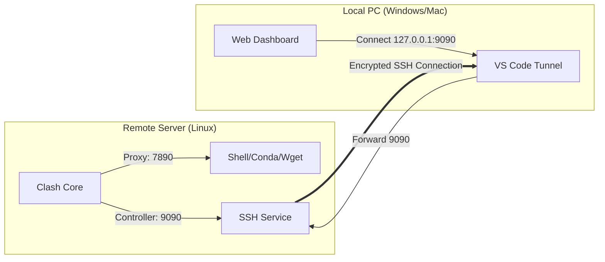

在深度学习训练或服务器运维中，经常需要服务器具备访问特定网络资源的能力。本文介绍如何在无公网 IP、无 GUI 的 Linux 环境下，通过 Clash Meta (Mihomo) 内核配合 SSH 隧道，实现稳定代理与便捷的图形化管理。

<!--more-->

## 1. 部署架构

为了在本地（Local PC）可视化管理服务器（Remote Server）上的 Clash 实例，我们采用 **VS Code 端口转发（SSH Tunneling）** 方案。



## 2. 环境初始化

首先将预编译好的 Clash 工作目录部署至用户主目录，确保拥有完整的读写权限。

```bash
# 假设源文件位于共享挂载点，复制到 Home 目录
cp -r /path/to/dist/clash ~/clash
cd ~/clash
```

## 3. 核心配置 (`config.yaml`)

使用编辑器（`nano` 或 `vim`）修改核心配置文件。

### 3.1 基础参数
*   **Access Control**: 必须确保 RESTful API 监听在 `0.0.0.0`，以便 SSH 隧道转发。
    ```yaml
    external-controller: 0.0.0.0:9090
    ```
*   **Security**: 修改 `secret` 字段，这是 Web 管理界面的登录密钥。
    ```yaml
    secret: "your-complex-password" 
    ```

### 3.2 订阅源配置 (Proxy Provider)
推荐使用 `proxy-providers` 模式，实现规则与节点分离。

*   **场景 A：专用订阅**
    替换 `url` 字段中的 User ID 和 Secret 为服务商提供的鉴权信息。
*   **场景 B：通用订阅**
    若使用通用机场链接，请确保生成的配置文件中包含策略组（Proxy Groups）定义，否则需手动合并配置。

---

## 4. 服务持久化运行

为防止 SSH 断开后进程终止，建议使用 `tmux` 进行会话管理。

```bash
# 1. 新建名为 'clash' 的后台会话
tmux new -s clash

# 2. 启动核心 (开启 debug 模式查看日志)
./clash -d .

# 3. 分离会话 (Detach)
# 按下 Ctrl + B，松开后按 D
```

---

## 5. 建立管理通道 (VS Code Port Forwarding)

由于服务器通常位于内网或防火墙后，直接访问 9090 端口不可行。利用 VS Code 的内置端口转发功能建立隧道：

1.  打开 VS Code 底部面板的 **PORTS (端口)** 标签页。
2.  点击 **Forward a Port (转发端口)**。
3.  添加以下两个端口：
    *   `9090`: Clash 控制端口（必须）。
    *   `7890`: HTTP 代理端口（可选，用于本地直接使用服务器代理）。
4.  状态显示为 **Forwarded** 即表示隧道建立成功。

---

## 6. Web Dashboard 可视化管理

现在，你的本地浏览器可以通过 SSH 隧道直接控制服务器上的 Clash。

1.  **访问面板**：打开 [MetaCubeXD](https://metacubexd.pages.dev/) (或其他兼容面板)。
2.  **建立连接**：
    *   **Host**: `127.0.0.1` (流量已被转发至本地)
    *   **Port**: `9090`
    *   **Secret**: 步骤 3.1 中设置的密码。
3.  **管理**：连接成功后，即可在界面中切换节点、查看延迟及分流规则。

---

## 7. Shell 环境变量集成

为了让 `curl`, `wget`, `pip`, `conda` 等命令行工具走代理，需在 `.bashrc` 中定义别名。

编辑 `~/.bashrc`，在末尾追加：

```bash
# Proxy Aliases
alias proxy='export http_proxy=http://127.0.0.1:7890 https_proxy=http://127.0.0.1:7890 all_proxy=socks5://127.0.0.1:7892'
alias unproxy='unset http_proxy https_proxy all_proxy'
```

重载配置使其生效：
```bash
source ~/.bashrc
```

## 8. 验证

```bash
# 1. 开启代理
proxy

# 2. 测试连通性 (Google HTTP Header Check)
curl -I https://www.google.com
```
若返回 `HTTP/1.1 200 OK`，即表示链路打通。

---

### Troubleshooting

*   **Error: `bind: address already in use`**: Clash 核心已在运行。
    *   *Fix*: 执行 `pkill clash` 终止旧进程，或 `tmux attach -t clash` 回到原有会话。
*   **Web 面板连接失败**:
    *   *Check 1*: VS Code 端口转发是否意外断开？
    *   *Check 2*: `config.yaml` 中的 `secret` 是否包含特殊字符导致解析错误？

---

<div style="font-family: 'Courier New', Consolas, monospace; background-color: #f6f8fa; border-left: 4px solid #0366d6; padding: 15px; margin-top: 40px; font-size: 0.85em; color: #586069; border-radius: 4px;">
  <strong>>_ SYSTEM_LOG::EOF</strong><br><br>
  [INFO] Documentation dynamically generated by <strong><span style="color: #0366d6;">Gemini-3-Pro</span></strong> Engine.<br>
  [INFO] Module: "Linux Proxy Deployment" initialized.<br>
  [WARN] Compliance Check: Ensure URL parameters are sanitized.<br>
  [STAT] Rendered in 38ms. Network topology optimized.<br>
  [HASH] <code>0xC4B1...A7D3</code> (Integrity Check Passed)<br>
</div>
