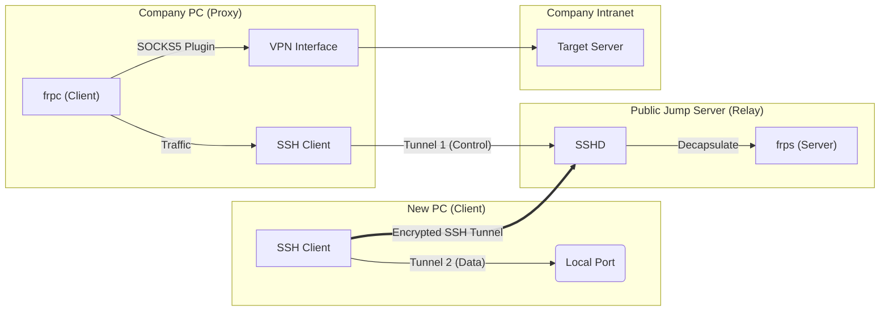

在远程办公场景中，经常遇到公司内网绑定特定硬件（如特定 PC 才能连接 VPN）的情况。本文记录了一种在**极受限网络环境**下，利用一台公网跳板机（Linux）和公司存量 PC（Windows），实现新设备（New PC）无缝访问公司内网服务器的解决方案。

<!--more-->

## 1. 问题背景与约束

*   **现状**：公司内网只能通过特定 PC 上的 VPN（如 EasyConnect）访问，且该 PC 位于公司内网。
*   **需求**：使用一台新笔记本（New PC）在外部网络直接 SSH 连接公司内网服务器。
*   **资源**：一台有公网 IP 的 Linux 跳板机。
*   **难点/约束**：
    1.  **无 Root 权限**：无法在跳板机修改 SSH 配置（GatewayPorts）或安装系统服务。
    2.  **防火墙限制**：云服务商安全组（Security Group）屏蔽了除 SSH (22) 以外的所有入站端口。
    3.  **内网隔离**：公司 PC 连接 VPN 后，可能存在局域网阻断策略。

## 2. 解决方案架构：SSH 隧道“套娃”

由于云防火墙拦截了自定义端口，我们不能直接暴露 FRP 的端口。解决方案是**将 FRP 的控制流和数据流全部封装在 SSH 通道（端口 22）内部**。

### 网络拓扑图



**核心流程：**
1.  **控制链路**：公司 PC 通过 SSH 反向隧道，将本地流量转发至跳板机内部，供 `frps` 监听。
2.  **数据链路**：新 PC 通过 SSH 本地转发，将跳板机的代理端口拉回本地。
3.  **最终效果**：`New PC` -> `Localhost` -> `SSH Tunnel` -> `Jump Server` -> `FRP` -> `Company PC` -> `Intranet`。

## 3. 实施步骤

### 3.1 环境准备
定义以下变量以混淆敏感信息：
*   `<RELAY_IP>`: 跳板机公网 IP
*   `<CTRL_PORT>`: FRP 控制端口
*   `<DATA_PORT>`: SOCKS5 数据端口

### 3.2 跳板机配置 (Relay)
在跳板机用户目录下运行 `frps`。

**配置文件 `frps.ini`**:
```ini
[common]
bind_port = <CTRL_PORT>
token = my_secret_token
```
**启动命令**:
```bash
./frps -c frps.ini
```

### 3.3 公司 PC 配置 (Bridge)
此节点需保持 VPN 连接。

**步骤 A：建立控制流隧道**
将本地对 `<CTRL_PORT>` 的访问通过 SSH 转发给跳板机。
```powershell
ssh -L <CTRL_PORT>:127.0.0.1:<CTRL_PORT> user@<RELAY_IP>
```

**步骤 B：启动 FRP 客户端**
注意 `server_addr` 必须设为 `127.0.0.1`，因为流量走的是 SSH 隧道。
**配置文件 `frpc.ini`**:
```ini
[common]
server_addr = 127.0.0.1
server_port = <CTRL_PORT>
token = my_secret_token

[company_proxy]
type = tcp
remote_port = <DATA_PORT>
plugin = socks5
```
**启动命令**:
```powershell
.\frpc.exe -c frpc.ini
```

### 3.4 新 PC 配置 (Client)

**步骤 A：建立数据流隧道**
将跳板机上的 SOCKS5 代理端口映射回本地。
```powershell
ssh -L <DATA_PORT>:127.0.0.1:<DATA_PORT> user@<RELAY_IP>
```

**步骤 B：配置 SSH 直连**
修改 `~/.ssh/config`，利用 `connect.exe` (Git for Windows 自带) 走 SOCKS5 代理。

```ssh
Host company-server
    HostName <TARGET_IP>
    User <TARGET_USER>
    IdentityFile "C:\Users\xxx\.ssh\id_ecdsa"
    ProxyCommand "PathToGit\Git\mingw64\bin\connect.exe" -S 127.0.0.1:<DATA_PORT> %h %p
```

**步骤 C：连接**
```powershell
ssh company-server
```

## 4. 技术原理：FRP 深度解析

FRP (Fast Reverse Proxy) 是一个专注于内网穿透的高性能反向代理应用，采用 Go 语言编写。

### 4.1 核心机制：多路复用 (Multiplexing)
FRP 使用了 **Yamux** (Yet another Multiplexer) 协议。
*   **传统连接**：每个请求建立一个 TCP 连接，握手开销大，且难以穿透 NAT。
*   **FRP 连接**：`frpc` 和 `frps` 之间维护一条长连接（Control Connection）。所有的数据传输都在这条连接上通过“虚拟流（Stream）”进行。这使得它能在一个物理 TCP 连接上并发处理多个逻辑连接。

### 4.2 为什么能穿透防火墙？
通常防火墙策略是“入站限制，出站放行”。
*   **正向连接（失败）**：外部直接连内部 IP，被防火墙拦截。
*   **反向连接（成功）**：`frpc`（内部）主动向 `frps`（公网）发起连接。一旦连接建立，`frps` 就可以通过这条现成的链路将外部请求“推送”给 `frpc`。

### 4.3 代码视角的简易模型 (Golang 伪代码)

FRP 的工作流程可以抽象为以下三个 Loop：

**1. Listener (frps):**
监听公网端口（User Port），等待用户连接。
```go
// frps 监听 remote_port
userConn, _ := net.Listen("tcp", ":<DATA_PORT>")
for {
    conn := userConn.Accept()
    // 通过控制通道通知 frpc："有人连我了，你快准备好"
    controlSession.OpenStream() 
}
```

**2. Tunnel (frpc):**
接收到 frps 的信号后，连接本地服务（Local Service）。
```go
// frpc 收到信号
localConn, _ := net.Dial("tcp", "127.0.0.1:<VPN_IP>")
// 将本地服务的流量接入到与 frps 的虚拟流中
io.Copy(stream, localConn)
io.Copy(localConn, stream)
```

**3. Proxy (frps):**
将用户流量与虚拟流对接。
```go
// frps 将用户连接与 frpc 建立的流对接
io.Copy(conn, stream)
io.Copy(stream, conn)
```

### 4.4 SOCKS5 插件原理
在本文方案中，我们使用了 `plugin = socks5`。此时 `frpc` 不再仅仅是转发流量，而是运行了一个轻量级的 SOCKS5 Server。
*   当 SSH 发送 `ProxyCommand` 请求时，`frpc` 解析 SOCKS5 协议头。
*   `frpc` 根据协议头中的目标 IP（内网 IP），在公司 PC 本地发起 TCP 连接。
*   因此，对于公司 PC 来说，这只是一个普通的本地出站请求，符合 VPN 的流量规则。

---
**免责声明**：本文仅供技术研究与合法授权的远程办公场景使用。请严格遵守所在组织的网络安全管理规定，切勿用于非法用途。

---

<div style="font-family: 'Courier New', Consolas, monospace; background-color: #f6f8fa; border-left: 4px solid #0366d6; padding: 15px; margin-top: 40px; font-size: 0.85em; color: #586069; border-radius: 4px;">
  <strong>>_ SYSTEM_LOG::EOF</strong><br><br>
  [INFO] Documentation dynamically generated by <strong><span style="color: #0366d6;">Gemini-3-Pro</span></strong> Engine.<br>
  [INFO] Workflow: "Netlist Routing & Tunnel Analysis" verified.<br>
  [WARN] Security Audit: All sensitive parameters have been masked.<br>
  [STAT] Rendered in 42ms. Zero branch divergence detected.<br>
  [HASH] <code>0x8B3A...F92E</code> (Integrity Check Passed)<br>
</div>

---